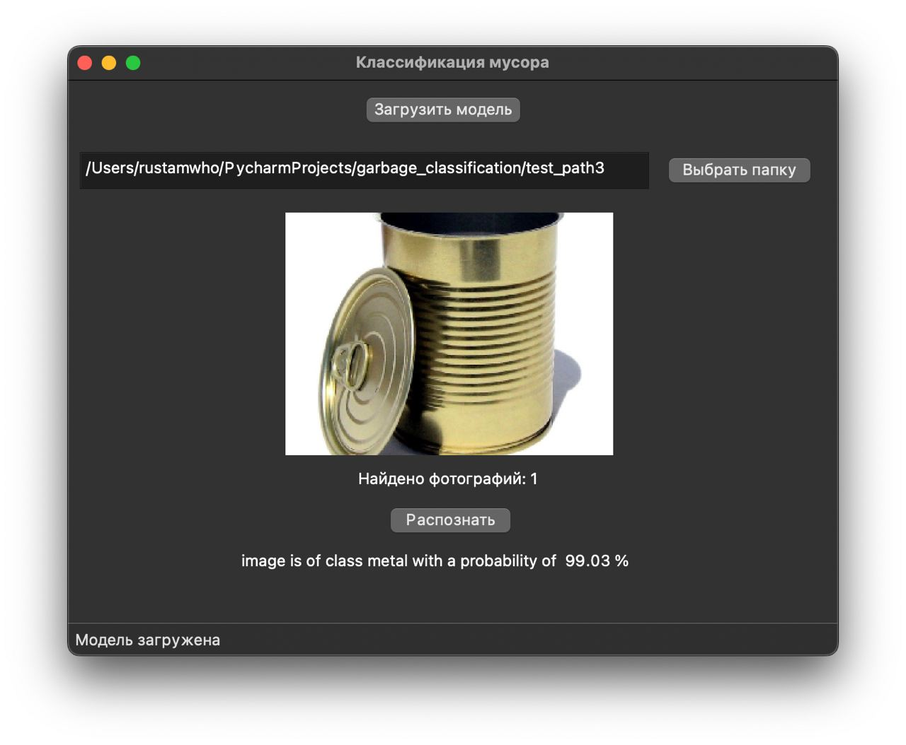

# Классификация мусора
Обученная нейронная сеть с архитектурой EfficientNetB3 для классификации мусора.
Для удобного использования разработан оконный интерфейс на PyQT5.




### Запуск приложения с GUI
1) Установить все зависимости из requirements.txt
2) Скачать [обученную модель](https://drive.google.com/drive/folders/1AfE7QOMO0LtdiDtxtFXy0MFiye77cQ82?usp=sharing)
3) Запустить выполнение main.py

### Ручной запуск классификации (garbage_classifier)
- Изменить значение ```store_path``` в ```garbage_classifier.py ```
- Запустить ```garbage_classifier.py ```

### О нейросетевой модели
Нейросеть обучена на датасете 12 классов (количество изображений > 15 000).

Типы отходов, на которых обучена модель:
1) Батарея 
2) Биологические отходы 
3) Коричневое стекло
4) Зеленое стекло
5) Белое (прозрачное) стекло
6) Картон
7) Бумага (журналы, газеты и тд.)
8) Одежда
9) Метал
10) Пластик
11) Обувь
12) Несортируемые отходы


Датасет можно скачать по [адресу](https://drive.google.com/drive/folders/1cSlr6E8QnaULB8bSfTR5obpTkWWODafr?usp=sharing).

Код, на котором обучалась нейросеть можно найти в [Jupiter Notebook](jupiter_notebooks/efficientnetb3_garbage_classifier.ipynb).

### P.S.
Классификатор по умолчанию выводит усредненный результат по классификации всех изображений в выбранной директории.
Следовательно, чтобы не путать модель, в директории должны лежать только изображения из одного класса мусора.

Чтобы получить индивидуальные результаты классификации по каждому изображению, следует вызывать классификатор (```predict```) с параметром ```averaged=False```.
Результаты возвращаются в DataFrame.